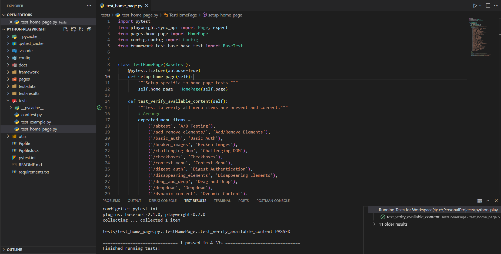

# Playwright Python Test Automation Framework



A robust and scalable test automation framework built with Python and Playwright for web application testing. This framework follows best practices and provides a solid foundation for implementing automated tests.

## 🚀 Features

- **Page Object Model** implementation for better maintainability
- **Configuration Management** for different environments
- **Comprehensive Logging** system
- **Screenshot Capture** on test failures
- **Cross-browser Testing** support (Chromium, Firefox, WebKit)
- **Parallel Test Execution** capability
- **Test Categories** (Smoke, Regression, E2E)
- **Detailed Test Reports**

## 📋 Prerequisites

- Python 3.8 or higher
- pip (Python package installer)
- Git

## 🛠️ Setup

1. Clone the repository:
```bash
git clone <repository-url>
cd python-playwright
```

2. Create and activate a virtual environment:
```bash
# Windows
python -m venv venv
.\venv\Scripts\activate

# Linux/Mac
python3 -m venv venv
source venv/bin/activate
```

3. Install dependencies:
```bash
pip install -r requirements.txt
```

4. Install Playwright browsers:
```bash
playwright install
```

## 🏃‍♂️ Running Tests

### Basic Test Execution
```bash
pytest
```

### Run Specific Test Categories
```bash
# Run smoke tests
pytest -m smoke

# Run regression tests
pytest -m regression

# Run end-to-end tests
pytest -m e2e
```

### Run Tests in Different Browsers
```bash
# Run in Firefox
BROWSER=firefox pytest

# Run in WebKit
BROWSER=webkit pytest
```

### Run Tests in Visible Mode
```bash
HEADLESS=false pytest
```

### Run Tests in Parallel
```bash
pytest -n auto
```

## 📁 Project Structure

```
python-playwright/
├── config/
│   └── config.py           # Configuration settings
├── docs/
│   └── images/            # Documentation images
├── framework/
│   └── page_base/         # Base page objects
├── pages/                 # Page objects
├── tests/                 # Test files
│   ├── conftest.py       # Test configurations
│   └── test_*.py         # Test cases
├── utils/                 # Utility functions
├── test-results/         # Test execution results
├── test-data/            # Test data files
├── pytest.ini            # Pytest configuration
└── requirements.txt      # Project dependencies
```

## 📝 Test Categories

- **Smoke Tests**: Basic functionality tests
- **Regression Tests**: Comprehensive test suite
- **E2E Tests**: End-to-end user journey tests

## 🔧 Configuration

The framework supports different configurations through environment variables:

- `BROWSER`: Browser to use (chromium, firefox, webkit)
- `HEADLESS`: Run tests in headless mode (true/false)
- `BASE_URL`: Application base URL

## 📊 Test Reports

Test reports are generated in the `test-results` directory:
- Screenshots of failed tests
- HTML reports (when using pytest-html)
- Log files

## 🤝 Contributing

1. Fork the repository
2. Create your feature branch (`git checkout -b feature/AmazingFeature`)
3. Commit your changes (`git commit -m 'Add some AmazingFeature'`)
4. Push to the branch (`git push origin feature/AmazingFeature`)
5. Open a Pull Request

## 📄 License

This project is licensed under the MIT License - see the [LICENSE](LICENSE) file for details.

## 👥 Authors

- Your Name - Initial work

## 🙏 Acknowledgments

- Playwright team for the amazing automation tool
- Python community for the excellent testing libraries 